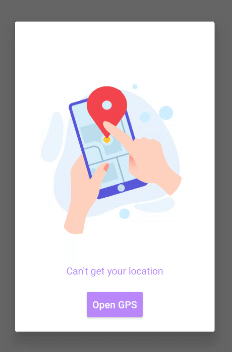
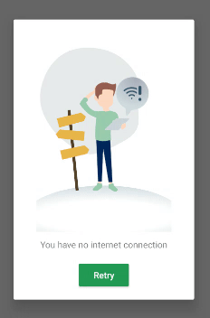

# LottieDialog


[](https://www.codacy.com/gh/AmrDeveloper/LottieDialog/dashboard?utm_source=github.com&amp;utm_medium=referral&amp;utm_content=AmrDeveloper/LottieDialog&amp;utm_campaign=Badge_Grade)
[](https://www.codefactor.io/repository/github/amrdeveloper/lottiedialog)
[]()

[](https://jitpack.io/#AmrDeveloper/Lottiedialog)

Android Library to create Lottie animation view dialog easily with a lot of customization

 
 

### Why you should use Lottie Dialog

- You have no limited type of dialog, you create your own types and using them.
- You don't need to add unused file in your project, just add what you will use.
- You can add any number of buttons and customize them as you want.
- Customize dialog title as you want, change color, size and visibility.
- Customize dialog message as you want, change color, size and visibility.
- You can change your dialog width and height by number of by percentage.
- You can change the animation view width and height.
- Set your animation easily from assets, raw resources or URLs.
- And more...

### Download or create Lottie animation file

- You can find many files and customize them from the Lottie offical website [LottieFiles.com](https://lottiefiles.com)
- You can create your own lottie file from scratch, check Lottie Plugins [LottieFiles.com/Plugins](https://lottiefiles.com/plugins/after-effects)

### Add Lottie Dialog to your project

From Maven Central
```gradle
implementation 'io.github.amrdeveloper:lottiedialog:1.0.0'
```
<details>
  <summary>Or Add LottieDialog from Jitpack.io</summary>
  
  Add it in your root build.gradle at the end of repositories
  
  ```gradle
  allprojects {
      repositories {
           maven { url 'https://jitpack.io' }
      }
  }
```
             
  Add the dependency      

  ```gradle
  implementation 'com.github.amrdeveloper:lottiedialog:1.0.0'
  ```
</details>

And sync the Gradle.

### Code Example

```java
Button okButton = new Button(this);
okButton.setText("Ok");
okButton.setOnClickListener(view -> {});

Button cancelButton = new Button(this);
cancelButton.setText("Cancel");
cancelButton.setOnClickListener(view -> {});

LottieDialog dialog = new LottieDialog(this)
    .setAnimation(R.raw.animation)
    .setAnimationRepeatCount(LottieDrawable.INFINITE)
    .setAutoPlayAnimation(true)
    .setTitle("Title")
    .setTitleColor(Color.WHITE)
    .setMessage("Message...")
    .setMessageColor(Color.WHITE)
    .setDialogBackground(Color.BLACK)
    .setCancelable(false)
    .addActionButton(okButton)
    .addActionButton(cancelButton)
    .setOnShowListener(dialogInterface -> {})
    .setOnDismissListener(dialogInterface -> {})
    .setOnCancelListener(dialogInterface -> {});
dialog.show();
```

### Documentation

Lottie Dialog was designed with a fluent interface concept and with the goal to make it customizable as much as we can

Set dialog title.
```java
setTitle(String title);
```

Set dialog title color.
```java
setTitleColor(int color)
```

Set dialog title text size.
```java
setTitleTextSize(float size)
```

Set dialog title visibility, the default value is `View.VISIBLE`.
```java
setTitleVisibility(int visibility)
```

Set dialog message.
```java
setMessage(String message)
```

Set dialog message text size.
```java
setMessageTextSize(float size)
```

Set message visibility, the default value is `View.VISIBLE`.
```java
setMessageVisibility(int visibility)
```

Set dialog background color.
```java
setDialogBackground(int color)
```

Set dialog background drawable.
```java
setDialogBackgroundDrawable(Drawable drawable)
```

Set dialog dim amount.
```java
setDialogDimAmount(float amount)
```

Set dialog cancelable.
```java
setCancelable(boolean cancelable)
```

Set dialog canceled on touch outside.
```java
setCanceledOnTouchOutside(boolean cancel)
```

Set dialog height.
```java
setDialogHeight(int height)
```

Set dialog width.
```java
setDialogWidth(int width)
```

Set dialog height by percentage, for example `0.50f` for `50%`.

```java
setDialogHeightPercentage(float percentage)
```

Set dialog width by percentage, for example `0.50f` for `50%`.

```java
setDialogWidthPercentage(float percentage)
```

Set Lottie animation view height.
```java
setAnimationViewHeight(int height)
```

Set Lottie animation view width.
```java
setAnimationViewWidth(int width)
```

Set animation from raw resources.
```java
setAnimation(@RawRes int rawRes)
```

Set animation from Animation object.
```java
setAnimation(Animation animation)
```

Set animation from assets folder
```java
setAnimation(String assetName)
```

Set animation from URL, need `INTERNET` permission
```java
setAnimationFromUrl(String url)
```

Set repeat count for the animation, for indefinitely use  `LottieDialog.INFINITE`
```java
setAnimationRepeatCount(int count)
```

Set animation speed
```java
setAnimationSpeed(float speed)
```

Add action button, you should set listeners and customize it then add it to Lottie dialog
```java
addActionButton(Button button)
```

Add action button with the index
```java
addActionButton(Button button, int index)
```

Control auto play animation when the dialog is showing
```java
setAutoPlayAnimation(boolean autoplay)
```

Check animation auto playing value
```java
isAutoPlayedAnimation()
```

Play the animation.
```java
playAnimation()
```

Pause the animation.
```java
pauseAnimation()
```

cancel the animation.
```java
cancelAnimation()
```

clear the animation.
```java
clearAnimation()
```

reverse the animation speed.
```java
reverseAnimationSpeed()
```

Check if is animating or not.
```java
isAnimating()
```

Show Lottie dialog.
```java
show()
```

Check if Lottie dialog is showing.
```java
isShowinng()
```

Dismiss Lottie dialog.
```java
dismiss()
```

Cancel Lottie dialog`.
```java
cancel()
```

Listen when Lottie dialog is showing.
```java
setOnShowListener(DialogInterface.OnShowListener listener)
```

Listen when Lottie dialog is canceled.
```java
setOnCancelListener(DialogInterface.OnCancelListener listener)
```

Listen when Lottie dialog is dismissed.
```java
setOnDismissListener(DialogInterface.OnDismissListener listener)
```

### How to contribute

- You are most welcome to request features, report bugs by creating a new issues.
- Before starting implementing the feature please make sure the issue is approved and assigned to you.
